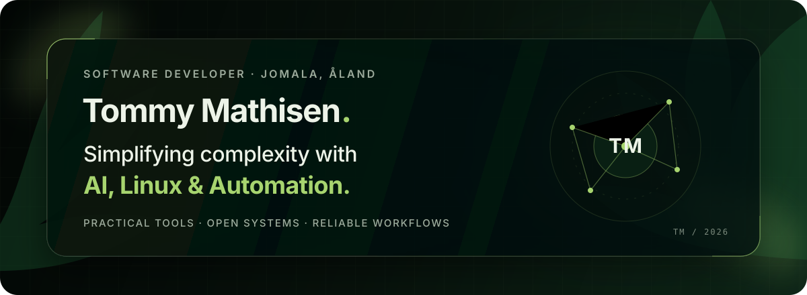

  

 

  
  
  
  

## Hey, I'm Tommy

I build tools that make complicated systems easier to understand and repetitive work less tedious. Most of what I do sits somewhere between **AI**, **Linux**, and **automation**, with a strong interest in open source and practical solutions that are genuinely useful.

## The toolbox

## Open-source signal

  

  

  Build useful things. Keep them understandable.

